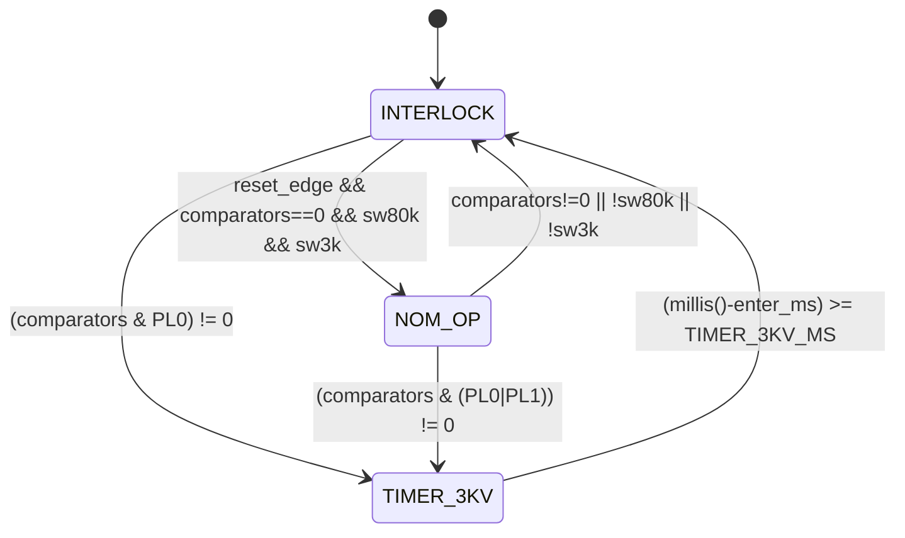

# Knob Box — Logic Arduino (Mega 2560 Rev 3)

This firmware (`logic_arduino.cpp`) implements the **Logic Arduino** portion of the Knob Box system. It runs a small safety-oriented state machine that:

- Reads **interlock comparators** (open-drain, fail-safe wiring) and **front-panel switches**
- Controls three hardware enables:
  - **CCS Enable** (A0 / PF0)
  - **Beam Enable** (A1 / PF1)
  - **3kV Enable** (A2 / PF2)
- Publishes **status + event flags** on two 8‑bit ports for a second Arduino (dashboard/test harness) to read.
- Uses an **ACK toggle input** to clear latched event flags.

The code uses **direct AVR register access** (DDRx/PORTx/PINx) for determinism and speed.

---

## Safety model and assumptions

### Comparator inputs (D42–D49, PORTL) are open-drain (wired-safe)

Comparator lines are treated as open-drain/open-collector:

- **SAFE:** comparator drives **LOW**
- **FAULT / INTERLOCK:** comparator is **Hi‑Z**, Arduino pullup makes input read **HIGH**
- **Disconnected wire:** reads **HIGH** → treated as **FAULT**

**In firmware:** comparator bits are read from `PINL` and **not inverted**.  
A `1` bit means **FAULT**.

---

## Tunable parameters

These constants are near the top of the file:

### `TIMER_3KV_MS` (default: `100`)
```cpp
static constexpr uint32_t TIMER_3KV_MS = 100;
```
3kV lockout duration (ms) after a 3kV trip.

### `DEBOUNCE_BITS` (default: `6`)
```cpp
static constexpr uint8_t  DEBOUNCE_BITS = 6; // 1..31
static constexpr uint32_t MASK_DEBOUNCE = (uint32_t)((1u << DEBOUNCE_BITS) - 1u);
```
Debounce length in **number of consecutive samples** (not milliseconds). The loop runs continuously; the effective time depends on loop rate.

> **Important:** `DEBOUNCE_BITS` must remain in `1..31`. Values outside that range can produce undefined behavior due to shifting.

---

## Hardware pin mapping

### Inputs

| Signal | Arduino Pin | AVR Port/Bit | Electrical | Polarity in code |
|---|---:|---|---|---|
| 3kV enable switch | D10 | PB4 | pullup enabled | **asserted = 1** |
| Arm beams switch | D11 | PB5 | pullup enabled | **asserted = 1** |
| CCS allow switch | D12 | PB6 | pullup enabled | **asserted = 1** |
| Arm 80kV switch | D13 | PB7 | pullup enabled | **asserted = 1** |
| ACK (toggle-to-clear) | D14 | PJ1 | pullup enabled | **high = 1** |
| Reset button | D15 | PJ0 | pullup enabled | **pressed = 1** |
| Comparators (8 lines) | D42–D49 | PL7..PL0 | pullups enabled | **FAULT = 1** |

#### Switch and reset inversion
Switches and reset are physically **active-low** at the pin (pulled high, asserted by pulling to GND). Sampling converts them to **asserted = 1**:

```cpp
s.switchesAssertPortB = (uint8_t)(~PINB) & MASK_SWITCHES_PORTB;
s.resetAsserted       = (PINJ & MASK_RESET_BTN) == 0;
```

ACK is **not inverted**:

```cpp
s.ackLevel = (PINJ & MASK_ACK) != 0;
```

---

### Outputs (hardware enables + LED)

| Output | Arduino Pin | AVR Port/Bit | Active level | Meaning |
|---|---:|---|---|---|
| CCS Enable | A0 | PF0 | HIGH enables | `out.ccsPowerEnable` |
| Beam Enable | A1 | PF1 | HIGH enables | `out.armBeamsEnable` |
| 3kV Enable | A2 | PF2 | HIGH enables | `out.enable3kV` |
| Interlock LED | D16 | PH1 | HIGH drives LED | **ON when NOT in NOM_OP** |

LED logic (as implemented):
- `out.nomOp == true` → LED **OFF**
- otherwise → LED **ON**

---

## Flag outputs (status + latched events)

Two 8‑bit ports are dedicated to flag outputs:

### PORTA (D22–D29): live outputs + NomOp + latched switch events
`PORTA` is rebuilt and written every `step()`:

| PORTA bit | Arduino Pin | Source | Latched? | Meaning |
|---|---:|---|---|---|
| PA0 | D22 | `out.ccsPowerEnable` | No | mirrors current CCS output |
| PA1 | D23 | `out.armBeamsEnable` | No | mirrors current Beam output |
| PA2 | D24 | `out.enable3kV` | No | mirrors current 3kV output |
| PA3 | D25 | `out.nomOp` | No | 1 = in NOM_OP |
| PA4–PA7 | D26–D29 | `prevFlagsSwitches` bits 4–7 | Yes | switch asserted at least once since last ACK toggle |

> **Code reality (important):** `prevFlagsSwitches` is latched from **raw sampled switches**, not the debounced switch values:
>
> ```cpp
> prevFlagsSwitches |= (uint8_t)(sample.switchesAssertPortB & MASK_SWITCHES_PORTB);
> ```
>
> The file header comment says “latched debounced switches”, but the implementation latches **raw** (potentially bouncy) assertions. If you want flags to be debounced, latch `switchesDebounced` instead.

### PORTC (D30–D37): latched comparator fault events
`PORTC` reflects `prevFlagsComparators`, a sticky OR of `PINL` since last ACK toggle:

```cpp
prevFlagsComparators |= sample.comparators; // sample.comparators = PINL
PORTC = prevFlagsComparators;
```

**Bit-ordering note:** `PINL` bits are copied into `PORTC` bits directly. Physical Arduino pin numbering on PORTC is reversed relative to bit indices:

| Bit index | PORTC bit | Arduino pin |
|---:|---|---:|
| 0 | PC0 | D37 |
| 1 | PC1 | D36 |
| 2 | PC2 | D35 |
| 3 | PC3 | D34 |
| 4 | PC4 | D33 |
| 5 | PC5 | D32 |
| 6 | PC6 | D31 |
| 7 | PC7 | D30 |

Comparator inputs are `PINL` (`PL0..PL7`) which correspond to Arduino `D49..D42` (PL0=D49, PL7=D42). If you need a one-to-one map for your harness, map by **bit position**, not by Arduino “Dn” numbers.

---

## ACK toggle-to-clear protocol (D14 / PJ1)

`write_flags()` uses an ACK level change to clear both latched event flag bytes:

- `prevFlagsComparators` (latched comparator faults)
- `prevFlagsSwitches` (latched switch assertions)

Any edge (low→high or high→low) clears:

```cpp
if (sample.ackLevel != prevAck) {
  prevFlagsComparators = 0;
  prevFlagsSwitches    = 0;
}
prevAck = sample.ackLevel;
```

This supports a simple dashboard/test harness handshake: **read flags → toggle ACK → flags clear**.

> On first call after boot, `prevAck` starts as `false`. If the external pullup makes ACK high at boot, the first call will detect a “toggle” (false→true) and clear latches (already 0). This is harmless but worth knowing.

---

## Debounce implementation

Debounce uses a shift-register history per signal:

- 4 switch histories: `switchHist[4]`
- reset button history: `resetButtonHist`

On each sample, history shifts left and inserts the newest sample bit in the LSB. If the last `DEBOUNCE_BITS` samples are all 0 or all 1, the stable value is updated; otherwise it holds.

```cpp
hist = (hist << 1) | (sample ? 1u : 0u);
maskedHist = hist & MASK_DEBOUNCE;
if (maskedHist == 0) stable = false;
else if (maskedHist == MASK_DEBOUNCE) stable = true;
```

**Reset edge detection** is performed on the debounced reset signal:

```cpp
const bool resetButtonEdge = resetButtonDb && !prevResetButtonDb;
prevResetButtonDb = resetButtonDb;
```

---

## State machine

### State enum
```cpp
enum class State : uint8_t {
  STATE_INTERLOCK  = 0,
  STATE_NOM_OP     = 1,
  STATE_3KV_TIMER  = 2
};
```

### Comparator masks used in logic
- `MASK_COMP_3KV_I` = `PL0` (Arduino D49) — 3kV **current** fault
- `MASK_COMP_3KV`   = `PL0 | PL1` (D49 + D48) — 3kV **current OR voltage** fault

```cpp
static constexpr uint8_t MASK_COMP_3KV      = _BV(PL0) | _BV(PL1);
static constexpr uint8_t MASK_COMP_3KV_I    = _BV(PL0);
```

---

### Overview of `step()`

Each `loop()` iteration calls `step()`:

1. `sample_inputs()` reads raw pins into a `Sample`
2. Switches + reset are debounced
3. State transitions are evaluated based on:
   - comparator faults (immediate)
   - debounced switches
   - reset **edge**
4. Outputs are assigned from state + debounced switches
5. Flags are updated (including ACK-cleared latches)
6. Outputs are driven (register writes only if changed)

---

## State behavior (as implemented)

### `STATE_INTERLOCK` (BI / Interlock)
**Transitions:**
- If **3kV overcurrent** fault (`comparators & MASK_COMP_3KV_I`) → enter `STATE_3KV_TIMER`, set `timerEnterMs = millis()`, and stop evaluating other transitions this step.
- Else if **resetButtonEdge** and **all comparators safe** and required switches asserted:
  - `comparators == 0`
  - `sw_arm_80kv == true` (D13)
  - `sw_3kv_enable == true` (D10)  
  → enter `STATE_NOM_OP`

**Outputs:**
- CCS enable: OFF
- Beam enable: OFF
- 3kV enable: follows **debounced** 3kV switch (`sw_3kv_enable`)
- `nomOp`: 0

---

### `STATE_NOM_OP` (Nominal Operation)
**Transitions (evaluated in this order):**
1. If **3kV V/I fault** (`comparators & MASK_COMP_3KV`) → enter `STATE_3KV_TIMER` and set `timerEnterMs`.
2. Else if any of the following:
   - any comparator fault (`comparators != 0`)
   - Arm 80kV switch deasserted (`!sw_arm_80kv`)
   - 3kV enable switch deasserted (`!sw_3kv_enable`)  
   → return to `STATE_INTERLOCK`

**Outputs:**
- CCS enable: follows debounced CCS allow switch (`sw_ccs_allow`, D12)
- Beam enable: follows debounced arm beams switch (`sw_arm_beams`, D11)
- 3kV enable: follows debounced 3kV switch (`sw_3kv_enable`, D10)
- `nomOp`: 1

---

### `STATE_3KV_TIMER` (3kV lockout)
**Transition:**
- If elapsed time is at least `TIMER_3KV_MS`, return to `STATE_INTERLOCK`:
  ```cpp
  if ((uint32_t)(millis() - timerEnterMs) >= TIMER_3KV_MS)
      currentState = State::STATE_INTERLOCK;
  ```

**Outputs (forced safe):**
- CCS enable: OFF
- Beam enable: OFF
- 3kV enable: OFF
- `nomOp`: 0

---

## Mermaid diagram (logic-equivalent)



---

## Initialization (`setup()`)

`setup()` performs:

- `io_init_registers()`:
  - configures DDR registers
  - enables pullups on inputs (switches, ack/reset, comparators)
  - forces safe posture on outputs (PF0–PF2 OFF; LED ON)
  - initializes PORTA/PORTC to 0
- initializes `prevPORTF` / `prevPORTH` to current output registers
- resets state to `STATE_INTERLOCK`
- clears debounce histories
- generates an initial flag image (`write_flags(rawSample, allOffOut)`)
- re-applies safe outputs (`write_outputs(allOffOut)`)

---

## Known discrepancies / logic notes (from code review)

1. **Switch event flags are NOT debounced.**  
   The header comment claims “latched debounced switches”, but `write_flags()` latches **raw sampled switch assertions**. If you see spurious latched switch flags, this is the likely cause.

2. **Potential 3kV “one-cycle pulse” when timer expires while fault persists.**  
   In `STATE_3KV_TIMER`, when the timer expires the firmware sets `currentState = INTERLOCK` and proceeds to output assignment **without re-checking** `MASK_COMP_3KV_I` that same step.  
   If the 3kV overcurrent fault (PL0) remains asserted at that moment and the 3kV enable switch is asserted, then for **one `step()` iteration** the `INTERLOCK` output assignment can re-enable 3kV before the next iteration re-enters the timer state.

   If this matters for your hardware, consider one of these fixes:
   - Keep the state in `STATE_3KV_TIMER` until the 3kV fault clears (in addition to time expiring).
   - Or, in `STATE_INTERLOCK` output assignment, force 3kV OFF when `MASK_COMP_3KV_I` is high.
   - Or, after changing `currentState` to `INTERLOCK` inside the timer state, immediately re-run/inline the interlock 3kI check before output assignment.

3. **Debounce time depends on loop rate.**  
   `DEBOUNCE_BITS` is a sample count; any change in loop timing changes debounce time.

---

## Extending the firmware safely

If you add new states or signals:

1. Update the `State` enum
2. Add transition logic in the state machine switch
3. Add explicit output assignments for the new state(s)
4. Decide whether the new signal should be:
   - **live status** (reflect current state), or
   - **latched event** (sticky until ACK toggles)

**Rule of thumb:** safety-relevant “events” should latch; operational “status” should reflect live state.

---

## File of record

- `logic_arduino.cpp` — main implementation
- Arduino entry points:
  - `setup()` initializes registers and safe posture
  - `loop()` calls `step()` continuously
