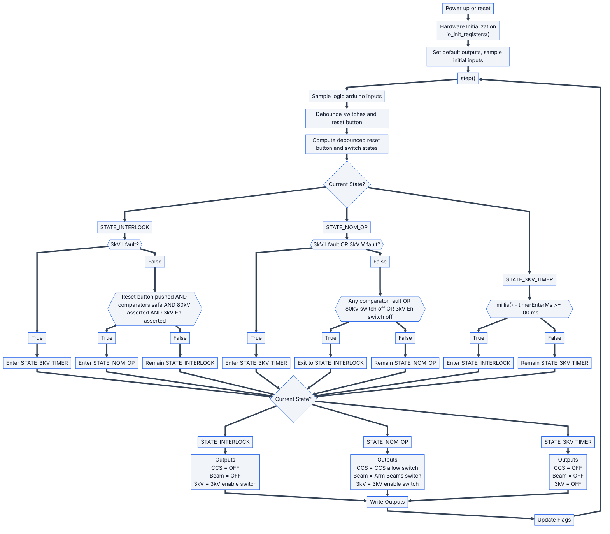

```mermaid
%%{init:{
  "theme":"base",
  "flowchart":{
    "nodeSpacing":12,
    "rankSpacing":18,
    "padding":4,
    "curve":"linear",
    "useMaxWidth": true
  },
  "themeVariables":{
    "fontFamily":"Inter, Segoe UI, Arial",
    "fontSize":"14px",

    "background":"#ffffff",
    "textColor":"#0f172a",

    "primaryColor":"#f1f5f9",
    "primaryTextColor":"#0f172a",
    "primaryBorderColor":"#2563eb",

    "secondaryColor":"#e2e8f0",
    "secondaryTextColor":"#0f172a",
    "secondaryBorderColor":"#64748b",

    "tertiaryColor":"#f8fafc",
    "tertiaryTextColor":"#0f172a",
    "tertiaryBorderColor":"#64748b",

    "lineColor":"#334155",
    "arrowheadColor":"#334155",

    "clusterBkg":"#f8fafc",
    "clusterBorder":"#94a3b8",

    "noteBkg":"#eff6ff",
    "noteBorderColor":"#2563eb",
    "noteTextColor":"#0f172a"
  }
}}%%

flowchart TD
    START[Power up or reset]
    START ==> INIT["Hardware Initialization\nio_init_registers()"]
    INIT ==> DEFAULT["Set default outputs, sample initial inputs"]
    DEFAULT ==> LOOP["step()"]

    LOOP ==> SAMPLE[Sample logic arduino inputs]

    SAMPLE ==> DEBOUNCE[Debounce switches and reset button]

    DEBOUNCE ==> SWITCHES[Compute debounced reset button and switch states]

    SWITCHES ==> STATE{Current State?}

    STATE ===> INTERLOCK[STATE_INTERLOCK]
    INTERLOCK ==> I_3KVI{{3kV I fault?}}
    I_3KVI ==> I_3KVI_T[True]
    I_3KVI ==> I_3KVI_F[False]
    I_3KVI_T ===> I_TO_TIMER[Enter STATE_3KV_TIMER]
    I_3KVI_F ===> I_NOMOP_COND{{Reset button pushed AND comparators safe AND 80kV asserted AND 3kV En asserted}}

    I_NOMOP_COND ==> I_NOMOP_T[True]
    I_NOMOP_COND ==> I_NOMOP_F[False]
    I_NOMOP_T ===> I_TO_NOMOP[Enter STATE_NOM_OP]
    I_NOMOP_F ===> I_STAY_I[Remain STATE_INTERLOCK]

    I_TO_TIMER ==> OUT_STATE
    I_TO_NOMOP ==> OUT_STATE
    I_STAY_I ==> OUT_STATE

    STATE ===> NOMOP[STATE_NOM_OP]
    NOMOP ==> N_3KVFAULT{{3kV I fault OR 3kV V fault?}}
    N_3KVFAULT ==> N_3KV_T[True]
    N_3KVFAULT ==> N_3KV_F[False]
    N_3KV_T ===> N_TO_TIMER[Enter STATE_3KV_TIMER]
    N_3KV_F ===> N_OTHERFAULT{{Any comparator fault OR 80kV switch off OR 3kV En switch off}}

    N_OTHERFAULT ==> N_OTHER_T[True]
    N_OTHERFAULT ==> N_OTHER_F[False]
    N_OTHER_T ===> N_TO_INTERLOCK[Exit to STATE_INTERLOCK]
    N_OTHER_F ===> N_STAY_N[Remain STATE_NOM_OP]

    N_TO_TIMER ==> OUT_STATE
    N_TO_INTERLOCK ==> OUT_STATE
    N_STAY_N ==> OUT_STATE

    STATE ===> TIMER[STATE_3KV_TIMER]
    TIMER ==> T_EXPIRE{{"millis() - timerEnterMs >= 100 ms"}}
    T_EXPIRE ==> T_EXP_T[True]
    T_EXPIRE ==> T_EXP_F[False]
    T_EXP_T ===> T_TO_INTERLOCK[Enter STATE_INTERLOCK]
    T_EXP_F ===> T_STAY_T[Remain STATE_3KV_TIMER]

    T_TO_INTERLOCK ==> OUT_STATE
    T_STAY_T ==> OUT_STATE

    OUT_STATE{Current State?}

    OUT_STATE ===> OUT_INTERLOCK_STATE[STATE_INTERLOCK]
    OUT_STATE ===> OUT_NOMOP_STATE[STATE_NOM_OP]
    OUT_STATE ===> OUT_TIMER_STATE[STATE_3KV_TIMER]

    OUT_INTERLOCK_STATE ==> OUT_INTERLOCK[Outputs\nCCS = OFF\nBeam = OFF\n3kV = 3kV enable switch]
    OUT_NOMOP_STATE ==> OUT_NOMOP[Outputs\nCCS = CCS allow switch\nBeam = Arm Beams switch\n3kV = 3kV enable switch]
    OUT_TIMER_STATE ==> OUT_TIMER[Outputs\nCCS = OFF\nBeam = OFF\n3kV = OFF]

    OUT_INTERLOCK ==> WRITE_OUTPUTS[Write Outputs]
    OUT_NOMOP ==> WRITE_OUTPUTS
    OUT_TIMER ==> WRITE_OUTPUTS

    WRITE_OUTPUTS ==> FLAGS[Update Flags]
    
    FLAGS ==> LOOP

```
