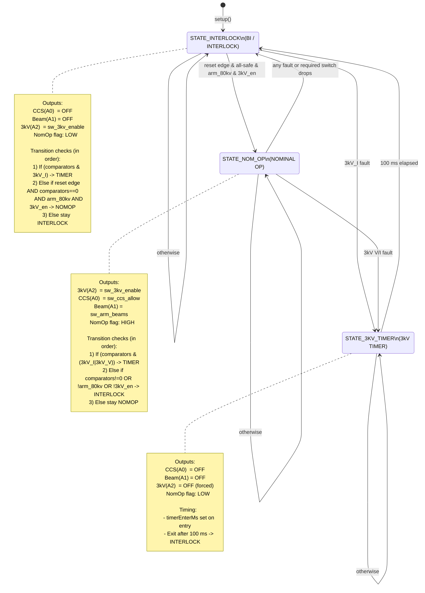

```mermaid
stateDiagram-v2
  direction TB

  state "STATE_INTERLOCK\n(BI / INTERLOCK)" as INTERLOCK
  state "STATE_NOM_OP\n(NOMINAL OP)" as NOMOP
  state "STATE_3KV_TIMER\n(3kV TIMER)" as TIMER

  note right of INTERLOCK
    Outputs:
      CCS(A0)  = OFF
      Beam(A1) = OFF
      3kV(A2)  = sw_3kv_enable

    NomOp flag: LOW

    Transition checks (in order):
      1) If (comparators & 3kV_I) -> TIMER
      2) Else if reset edge AND comparators==0
         AND arm_80kv AND 3kV_en -> NOMOP
      3) Else stay INTERLOCK
  end note

  note right of NOMOP
    Outputs:
      3kV(A2)  = sw_3kv_enable
      CCS(A0)  = sw_ccs_allow
      Beam(A1) = sw_arm_beams

    NomOp flag: HIGH

    Transition checks (in order):
      1) If (comparators & (3kV_I|3kV_V)) -> TIMER
      2) Else if comparators!=0 OR !arm_80kv OR !3kV_en -> INTERLOCK
      3) Else stay NOMOP
  end note

  note right of TIMER
    Outputs:
      CCS(A0)  = OFF
      Beam(A1) = OFF
      3kV(A2)  = OFF (forced)

    NomOp flag: LOW

    Timing:
      - timerEnterMs set on entry
      - Exit after 100 ms -> INTERLOCK
  end note

  [*] --> INTERLOCK : setup()

  INTERLOCK --> TIMER : 3kV_I fault
  INTERLOCK --> NOMOP : reset edge & all-safe & arm_80kv & 3kV_en
  INTERLOCK --> INTERLOCK : otherwise

  NOMOP --> TIMER : 3kV V/I fault
  NOMOP --> INTERLOCK : any fault or required switch drops
  NOMOP --> NOMOP : otherwise

  TIMER --> INTERLOCK : 100 ms elapsed
  TIMER --> TIMER : otherwise

```
